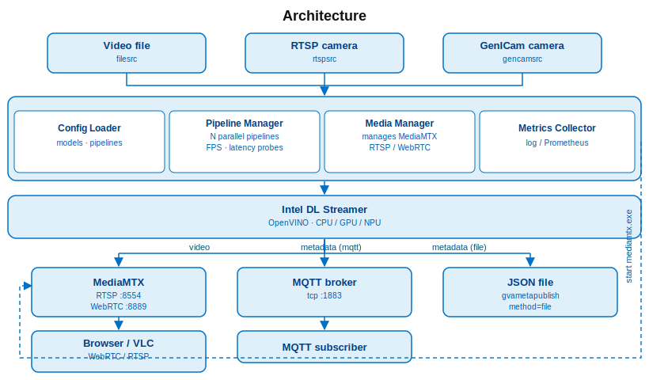

# Win Vision AI

<!--hide_directive

  <a class="icon_github" href="https://github.com/open-edge-platform/edge-ai-suites/tree/main/manufacturing-ai-suite/industrial-edge-insights-vision/win-vision-ai">
     GitHub
  </a>
  <a class="icon_document" href="https://github.com/open-edge-platform/edge-ai-suites/blob/main/manufacturing-ai-suite/industrial-edge-insights-vision/win-vision-ai/README.md">
     Readme
  </a>

hide_directive-->

**Win Vision AI** is a Python application for running multiple AI inference pipelines
concurrently on Intel hardware (CPU / GPU / NPU) on Windows. Built on GStreamer and Intel®
DL Streamer, it handles the end-to-end pipeline — from camera or video input,
through OpenVINO-accelerated detection and classification, to live RTSP / WebRTC
streaming and structured metadata output.

Configuration is YAML-driven: define your models, input sources, and outputs, then
run. Advanced users can supply raw GStreamer pipeline strings directly for full
control.

> **Platform:** Windows 11

## Architecture

### Inputs

- **Video file** — local video file playback
- **RTSP camera** — network camera stream
- **GenICam camera** — industrial camera via GenICam SDK

### Application

- **Config Loader** — loads and validates YAML configuration; defines models and pipelines
- **Pipeline Manager** — manages N parallel GStreamer pipelines with FPS and latency probes
- **Media Manager** — manages the embedded MediaMTX server for RTSP and WebRTC output
- **Metrics Collector** — exports pipeline metrics to log or Prometheus

### Inference

- **Intel DL Streamer** — runs object detection and classification inference using OpenVINO on CPU, GPU, or NPU

### Outputs

- **MediaMTX** — re-streams encoded video over RTSP (port 8554) and WebRTC (port 8889)
- **MQTT broker** — receives structured inference metadata over TCP (port 1883)
- **JSON file** — writes inference metadata to disk

### Viewers

- **Browser / VLC** — consume the live stream over WebRTC or RTSP
- **MQTT subscriber** — consumes inference metadata published to the MQTT broker

## Supporting Resources

- [DL Streamer Documentation](https://docs.openedgeplatform.intel.com/dev/edge-ai-libraries/dlstreamer/index.html)
  - [DL Streamer Supported Models](https://docs.openedgeplatform.intel.com/dev/edge-ai-libraries/dlstreamer/supported_models.html)
  - [DL Streamer Model Conversion Scripts README](https://github.com/open-edge-platform/dlstreamer/blob/main/scripts/download_models/README.md)

<!--hide_directive
:::{toctree}
:hidden:

Get Started <./get-started.md>

:::
hide_directive-->
