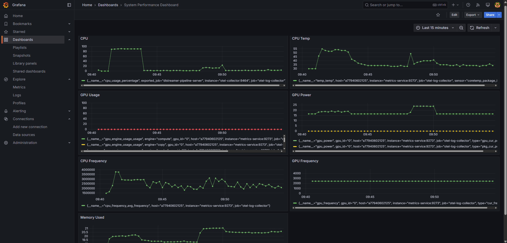

# View System Performance Dashboard

The **System Performance Dashboard** in Grafana visualizes real-time system hardware metrics
collected by the `metrics-service` and scraped by Prometheus. The supported metrics are:

- `cpu_usage_percentage`: CPU usage percentage of the host
- `temp_temp`: CPU temperature
- `cpu_frequency_avg_frequency`: Average CPU frequency
- `gpu_engine_usage_usage`: GPU engine utilization percentage
- `gpu_power`: GPU power consumption
- `gpu_frequency`: GPU operating frequency
- `mem_used_percent`: Host memory usage percentage

## Open the Dashboard in Grafana

### For Docker

Open [`https://<HOST_IP>/grafana/`](https://<HOST_IP>/grafana/) in your browser and log in
with the default credentials (`admin` / `admin`).

### For Helm

Open [`https://<HOST_IP>:30443/grafana/`](https://<HOST_IP>:30443/grafana/) in your browser
and log in with the default credentials (`admin` / `admin`).

### Navigate to the Dashboard

1. Click **Dashboards** in the left sidebar.
2. Select **System Performance Dashboard** from the list.

    *System performance metrics displayed in the System Performance Dashboard*

## Dashboard Panels

Each panel displays a time-series graph for the last 5 minutes by default. The panels are:

- **CPU** — tracks `cpu_usage_percentage` over time
- **CPU Temp** — tracks `temp_temp` over time
- **CPU Frequency** — tracks `cpu_frequency_avg_frequency` over time
- **GPU Usage** — tracks `gpu_engine_usage_usage` over time
- **GPU Power** — tracks `gpu_power` over time
- **GPU Frequency** — tracks `gpu_frequency` over time
- **Memory Used** — tracks `mem_used_percent` over time

> **Note:** Use the time picker in the top-right corner of Grafana to adjust the time range
> (for example, last 15 minutes or last 1 hour).
